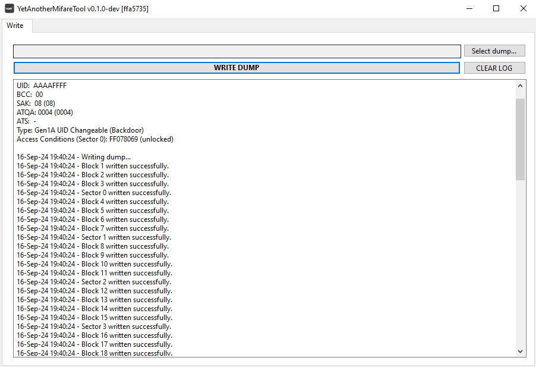
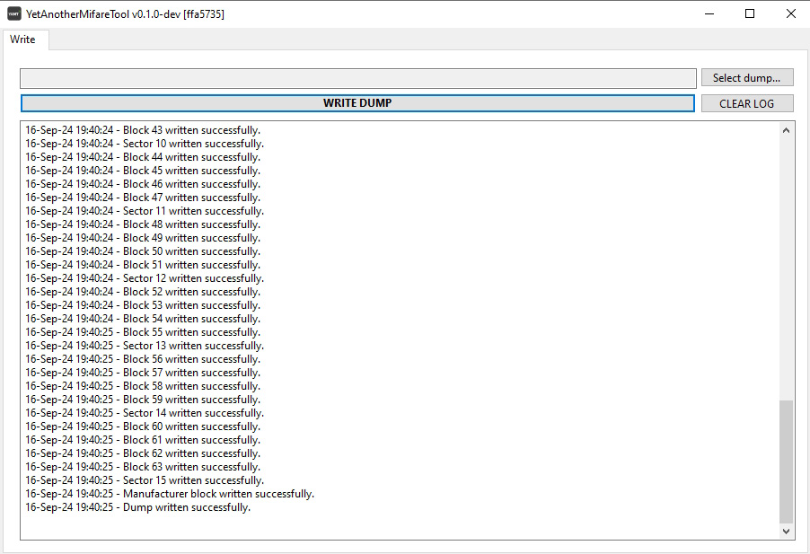

# YetAnotherMifareTool (YAMT)

## Overview

**YetAnotherMifareTool (YAMT)** supports **ACR122U** NFC Reader/Writer.

It allows you to write to Mifare Classic 1k cards:
- **Gen1** UID LOCKED
- **Gen1A** UID Changeable (Backdoor)
- **Gen1B** UID Changeable (Backdoor)
- **Gen2** CUID

## Usage

1. Download latest release of **[YetAnotherMifareTool](https://github.com/MirakelDev/YetAnotherMifareTool/releases/latest)** and **extract it**.
2. Connect the **ACR122U** NFC Reader/Writer.
3. Place a **Mifare Classic 1k (Magic) card** onto the reader.
4. Run the "**YetAnotherMifareTool.exe**" and use "**Select dumps...**" to select a dump.
5. Simply click "**WRITE DUMP**" and wait for it to finish.
6. **That's it!** The software manages all the technical details, so you don’t have to worry about a thing.

## Screenshots

## Errors Explained

 - **System.Exception: Error opening NFC reader**
> [!TIP]
> Please **connect** your **ACR122U** NFC device.

---

 - **System.DllNotFoundException: Unable to load DLL 'libnfc' or one of its dependencies: The specified module could not be found.**
> [!TIP]
> **Extract** the latest release of **YetAnotherMifareTool** and **run** the "**YetAnotherMifareTool.exe**. Ensure it's **not run directly from the zip archive**.

---

 - **Error: Unable to write toys with signature to Gen1 UID LOCKED cards. Use a toy without signature or another card...**
> [!TIP]
> You **cannot** write **Toys with Signature** to **Gen1 UID-locked** cards. Please use **Gen1 UID re-writable** or **blank Gen2** cards instead.

---

 - **Error: Unable to write toys with signature to used Gen2 CUID cards. Use a toy without signature or another card...**
> [!TIP]
> Gen2 cards **cannot** be **rewritten** with a different **Toy with Signature**. They can only be **rewritten** with **Toys without Signature**.

---

 - **Error: Sector 0 is locked (by access conditions). Use another card...**
 - **Error: Uid is locked and sector 0 is locked (by access conditions)! Use another card...**
> [!TIP]
> You've used dumps causing **locked access conditions** for **Sector 0** on that card before.
> 
> To avoid this, use a **new blank card** and only write that card with **YetAnotherMifareTool** to ensure Sector 0 remains **unlocked**.

---

 - **Error: Unknown magic card type. Use another card...**
> [!TIP]
> You need **Mifare Classic 1k Magic** cards. **NTAG** or other cards are **not compatible**.
